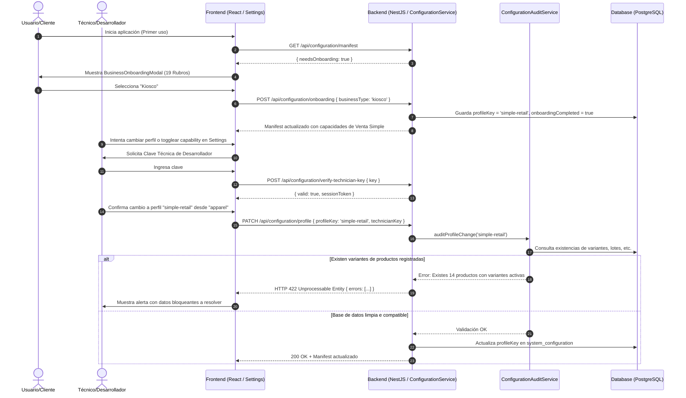

# Diseño Técnico (Design): Perfiles de Negocio y Gobernanza

**Cambio:** `perfiles-de-negocio`  
**Estado:** Diseño Completado  
**Fecha:** 2026-08-11  

---

## 1. Arquitectura del Sistema



---

## 2. Cambios de Modelo de Datos y Entidades

### A. Entidad `SystemConfiguration` (`system-configuration.entity.ts`)
Se incorporan/actualizan los siguientes campos:
* `profileKey`: varchar(64) restringido a los 7 perfiles válidos (`simple-retail`, `hardware`, `apparel`, `weight`, `expiry-tracking`, `electronics`, `wholesale`).
* `onboardingCompleted`: boolean, default `false`.
* `selectedBusinessType`: varchar(64), nullable (ej: `'kiosco'`, `'ferreteria'`).

### B. Migración de Base de Datos
* Migración TypeORM en `apps/backend/src/migrations/1770700000000-AddBusinessProfilesAndOnboarding.ts`.
* **Registro obligatorio** en `apps/backend/src/migrations.ts` y test de consistencia pasando verde.

---

## 3. Estructura de Módulos Backend

### A. Actualización de Capabilities (`keys.ts` & `presets.ts`)
* `CAPABILITY_PROFILE_KEYS`: `['simple-retail', 'hardware', 'apparel', 'weight', 'expiry-tracking', 'electronics', 'wholesale']`.
* Mapeo de `BUSINESS_TYPE_TO_PROFILE`: Diccionario con los 19 rubros mapeados a su perfil técnico correspondiente.
* Inclusión de las 7 nuevas capabilities granulares (`TOOLING.blind_cash_closing`, `TOOLING.park_sales`, etc.).

### B. Servicio `ConfigurationAuditService`
Implementa las siguientes verificaciones:
```typescript
export interface AuditResult {
  canSwitch: boolean;
  blockingReasons: string[];
}

@Injectable()
export class ConfigurationAuditService {
  async auditProfileSwitch(currentProfile: string, targetProfile: string): Promise<AuditResult> {
    const blockingReasons: string[] = [];
    const targetPreset = CAPABILITY_PRESETS[targetProfile];

    if (!targetPreset['STRUCTURAL.variants']) {
      const variantsCount = await this.variantsRepository.count({ where: { isActive: true } });
      if (variantsCount > 0) {
        blockingReasons.push(`Existen ${variantsCount} productos con variantes cargadas. Debe archivarlos antes de cambiar a un perfil sin variantes.`);
      }
    }
    // Repetir para lotes, seriales, etc...
    return { canSwitch: blockingReasons.length === 0, blockingReasons };
  }
}
```

---

## 4. Componentes y UI Frontend

1. **`BusinessOnboardingModal.tsx`:**
   - Presenta los 19 rubros organizados con íconos vectoriales claros.
   - Al seleccionar un rubro, realiza el POST de onboarding y fuerza la recarga suave del manifest con React Query.
2. **`TechnicianKeyModal.tsx`:**
   - Modal de diálogo con input tipo password para ingresar la clave técnica.
   - Guarda el estado desbloqueado temporalmente en la vista de Settings.
3. **`CapabilitiesTab.tsx` (Rediseñado):**
   - Muestra el perfil actual de forma amigable (ej: *"Perfil Activo: Venta Simple - Rubro Kiosco"*).
   - Botón *"Modo Técnico"* con ícono de candado para solicitar la clave antes de permitir cambios de perfil o toggles de capabilities.
